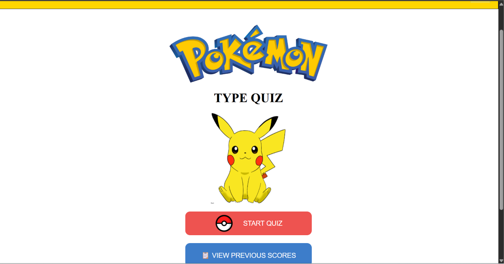
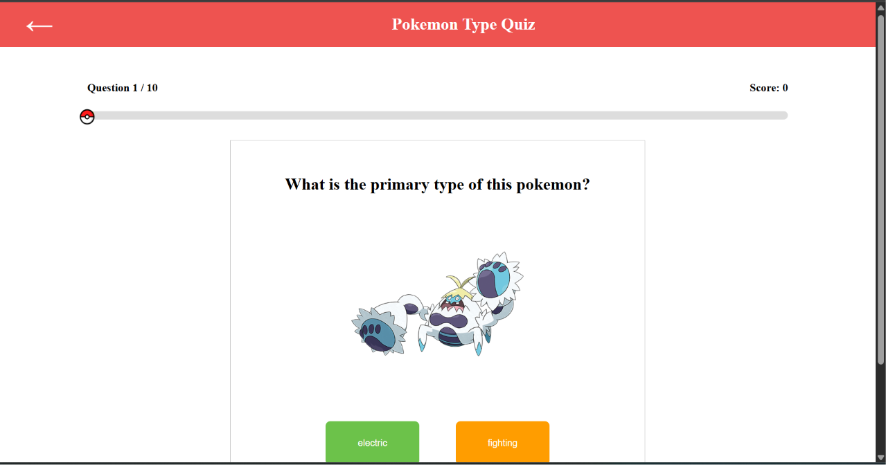

# 🎮 Pokémon Type Quiz

A fun and interactive web-based quiz that tests your knowledge of Pokemon types. Players are shown a random Pokemon image and must correctly identify its type from four options. The application tracks previous quiz attempts using Local Storage and provides a clean, responsive interface inspired by the Pokemon theme.

---

## 📸 Features

- 🎲 Random Pokemon fetched using the PokéAPI
- 🖼️ Official Pokemon artwork displayed for every question
- ❓ Four randomized type options for each question
- 📊 Progress bar with moving Poké Ball indicator
- 🏆 Real-time score tracking
- 🔟 10-question quiz format
- 💾 Stores previous quiz scores using Local Storage
- 📅 Displays date, score, total questions, and accuracy for every attempt
- 📱 Responsive and beginner-friendly UI
- 🎨 Pokémon-inspired color scheme and animations

---

## 🛠️ Technologies Used

- HTML5
- CSS3
- JavaScript (ES6)
- Fetch API
- Local Storage
- PokéAPI

---

## 📂 Project Structure

```
Pokemon-Type-Quiz/
│
├── index.html
├── quiz.html
├── scores.html
│
├── style.css
├── quiz.css
├── scores.css
│
├── quiz.js
│
└── images/
```

---

## 🚀 How to Run

1. Clone this repository.

```bash
git clone <https://github.com/riddhimacodes17/PokemonTypeMatcher.git>
```

2. Open the project folder.

3. Open `index.html` in your browser or run it using the VS Code Live Server extension.

---

## 🎯 How to Play

1. Click **Start Quiz**.
2. A random Pokémon image will appear.
3. Select the correct Pokémon type from the four options.
4. Complete all 10 questions.
5. Your score is automatically saved.
6. View all your previous attempts from the **Previous Scores** page.

---

## 🌐 API Used

This project uses the **PokéAPI** to fetch Pokémon information and official artwork.

https://pokeapi.co/

---

## 📷 Screenshots

### Home Page



### Quiz Page



### Previous Scores


---


## 👩‍💻 Author

**Riddhima Agarwal**

Built as a Web Development recruitment project to practice HTML, CSS, JavaScript, Fetch API, DOM Manipulation, and Local Storage.